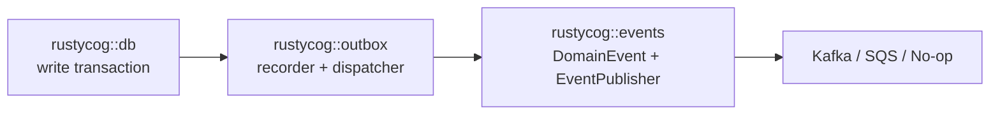

# RustyCog Events

`rustycog::events` (historically `rustycog-events`) provides the event envelope and queue transport adapters used by `[[projects/rustycog/rustycog]]` services.

## Key Ideas

- `DomainEvent` standardizes event identity, aggregate linkage, timestamp, version, JSON serialization, and metadata.
- `EventPublisher<TError>` and `EventConsumer` define async contracts independent from transport choice.
- Factory helpers create Kafka, SQS, or no-op publishers/consumers from `QueueConfig`.
- SQS factory paths initialize rustls' AWS-LC crypto provider once before AWS SDK usage.
- In test mode (`cfg(test)` or `test-utils`), Kafka usage depends on both config enablement and test-container env vars (`RUSTYCOG_KAFKA__HOST`, `PORT`, `ENABLED`), while SQS uses enablement checks.
- In both test and production modes, failed transport setup can fall back to no-op behavior instead of hard failing startup.
- `create_multi_queue_event_publisher()` still returns one generic publisher adapter, but SQS fanout now lives inside `SqsEventPublisher` rather than in service-local adapter logic.
- `SqsEventPublisher::publish()` resolves all configured destination queues for an event type and sends the same serialized event to each queue.
- `SqsEventPublisher::publish_batch()` groups batch entries by destination queue before calling SQS batch APIs, so mixed event types do not accidentally share the first event's queue.
- `SqsEventConsumer` starts one polling loop per configured SQS queue URL and shares the same `EventHandler` plus stop flag across those tasks.
- Publisher and consumer health checks now inspect all configured SQS queues instead of probing only a single default queue.
- `rustycog::events` remains transport-only; `[[projects/rustycog/references/rustycog-outbox]]` is the separate bridge module for DB-backed event durability.

## Outbox Boundary

`rustycog::outbox` depends on both DB and events so services can record event intent transactionally without adding database concerns to the transport module.

## Linked Entities

- [[entities/domain-event]]
- [[entities/event-publisher]]
- [[entities/queue-config]]
- [[projects/rustycog/references/rustycog-outbox]]

## Open Questions

- Startup fallback to no-op publishers/consumers improves resilience but can hide broken messaging configuration if not observed closely. ^[ambiguous]

## Sources

- [[projects/rustycog/references/index]]
- [[concepts/event-driven-microservice-platform]]
- [[projects/rustycog/rustycog]]
