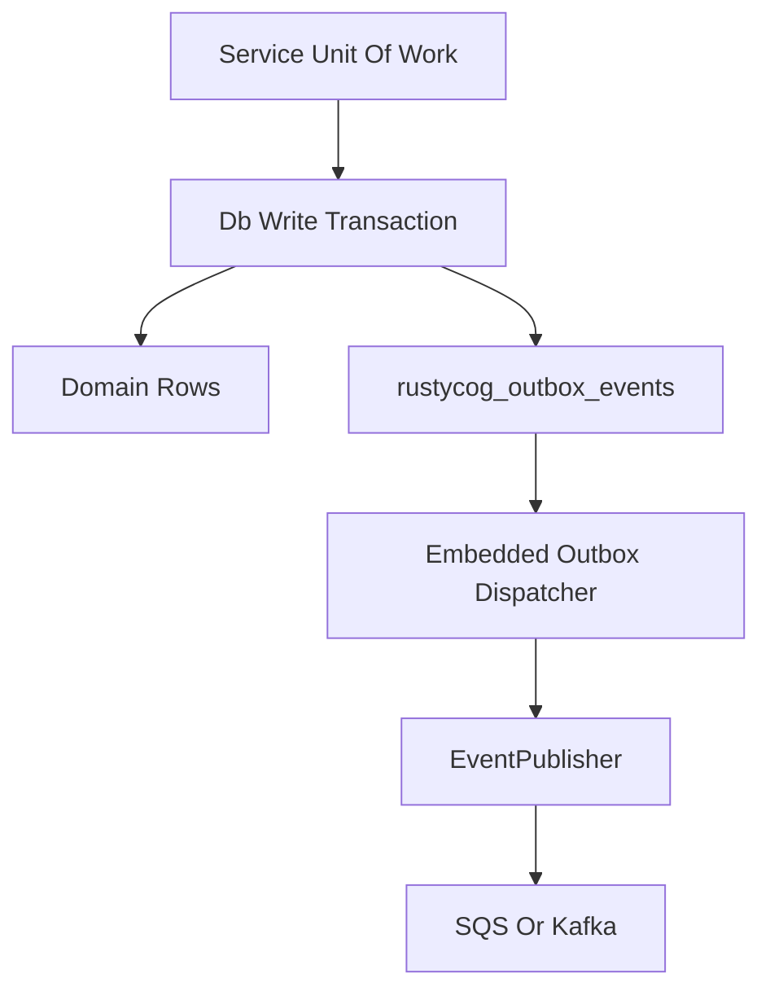
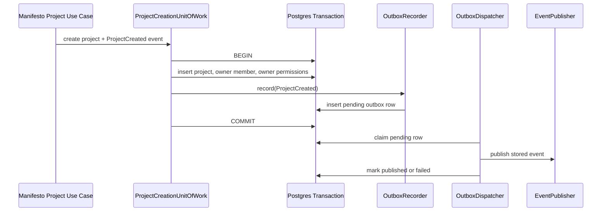
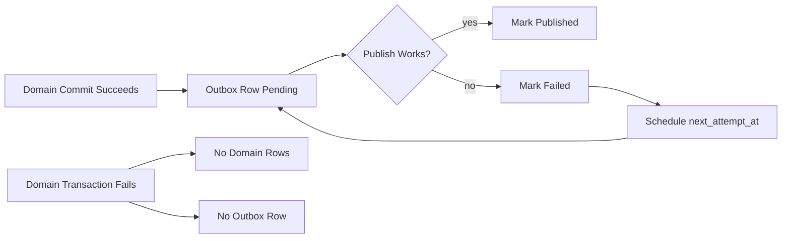

# RustyCog Outbox

`rustycog::outbox` (historically `rustycog-outbox`) is the integration module that connects [[projects/rustycog/references/rustycog-db]] and [[projects/rustycog/references/rustycog-events]] while keeping `rustycog::events` transport-only. Services opt into the outbox migration explicitly, record domain events inside their own write transaction, and let an embedded dispatcher publish through [[entities/event-publisher]] after commit.

## Architectural Flow

## Project Creation Sequence

## Key Semantics

- The outbox table stores `event_id`, `event_type`, `aggregate_id`, event version, event payload JSON, metadata JSON, status, attempts, lock ownership, retry time, and the last publish error.
- `OutboxRecorder::record()` accepts any SeaORM `ConnectionTrait`, so a service can pass the same `DatabaseTransaction` used for domain rows.
- The dispatcher claims retryable rows by moving them to `publishing`, increments attempts, sets `locked_by` / `locked_until`, publishes through the injected `EventPublisher`, and then marks the row `published` or `failed`.
- Delivery is at-least-once: `event_id` is the durable idempotency key, and downstream consumers still need duplicate-safe handling.
- Manifesto is the first rollout slice: `ProjectCreated` is recorded in the project-creation transaction and dispatched asynchronously after commit.

## Failure Behavior

If the queue is down, the project commit still succeeds and the outbox row remains retryable. If the database transaction rolls back, neither the project rows nor the event intent survive.

## Related Notes

- [[concepts/event-driven-microservice-platform]]
- [[projects/rustycog/references/rustycog-db]]
- [[projects/rustycog/references/rustycog-events]]
- [[projects/rustycog/references/index]]
