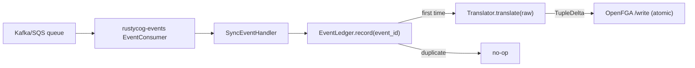

# Sentinel Sync Worker

`sentinel-sync` is a Rust binary (crate `sentinel-sync/`) that bridges the existing event bus to the centralized OpenFGA store.

## Layout

- `main.rs` — boots logging, loads config, builds the OpenFGA write client, the idempotency ledger, the translator list, and the concrete event consumer; waits on SIGINT.
- `config.rs` — `SentinelSyncConfig` with `logging`, `queue` (shared RustyCog types), `openfga` (the shared `OpenFgaClientConfig` from [[projects/rustycog/references/rustycog-config]]), and `idempotency`. Loads from `config/sentinel-sync.toml` and `SENTINEL_SYNC__*` env vars.
- `fga_client.rs` — minimal `reqwest`-based OpenFGA HTTP client covering `POST /stores/{id}/write` (atomic writes + deletes) and the `Tuple` helper types.
- `idempotency.rs` — `EventLedger` trait plus `InMemoryEventLedger`. Postgres backend is reserved (`idempotency.backend = "postgres"` returns an error until implemented).
- `translator/` — one module per producer service (`hive`, `manifesto`, `iam`). Each implements `Translator::translate(raw_event) -> Option<TupleDelta>`.
- `handler.rs` — `SyncEventHandler` dispatches one event: records in the ledger, tries translators in order, applies the resulting delta atomically.

## Data flow



## Configuration

```toml
[openfga]
scheme = "http"
host = "localhost"
port = 8080
store_id = "01HX..."
authorization_model_id = "01HX..."   # optional
api_token = "..."                    # optional

[idempotency]
backend = "in-memory"                # or "postgres" (planned)

[queue]
kind = "kafka"                       # shared RustyCog QueueConfig
# ...
```

Sample file: [sentinel-sync/config/sentinel-sync.toml.example](../../../../sentinel-sync/config/sentinel-sync.toml.example).

The split `scheme` / `host` / `port` shape mirrors service OpenFGA config and supports `port = 0` for testcontainer-backed runs. When tests boot `sentinel-sync` beside [[projects/rustycog/references/openfga-real-testcontainer-fixture]], the fixture publishes `SENTINEL_SYNC_OPENFGA__SCHEME`, `HOST`, `PORT`, `STORE_ID`, and `AUTHORIZATION_MODEL_ID` so the worker writes tuples into the same fresh OpenFGA store as the service under test.

## Idempotency

`SyncEventHandler` records every `event_id` in the ledger before processing. A duplicate record is treated as "already applied" and silently skipped. Retried deliveries and replays are safe.

The in-memory ledger is appropriate for tests and local runs; the planned Postgres backend will store `(event_id, processed_at)` rows in a dedicated schema next to OpenFGA's datastore so restarts are safe too.

## Translators

Each translator decodes the raw JSON into the service's `DomainEvent` enum. Decoding failure yields `None` (the event belongs to another service). A successful decode returns a `TupleDelta { writes, deletes }`. An empty delta is valid — most domain events are not authorization-relevant.

The concrete event-to-tuple mappings live in [[projects/sentinel-sync/references/event-to-tuple-mapping]].

## Related

- [[projects/sentinel-sync/sentinel-sync]]
- [[projects/sentinel-sync/references/openfga-model]]
- [[projects/sentinel-sync/references/event-to-tuple-mapping]]
- [[projects/rustycog/references/openfga-real-testcontainer-fixture]]
- [[concepts/openfga-as-authorization-engine]]
- [[entities/relation-tuple]]
